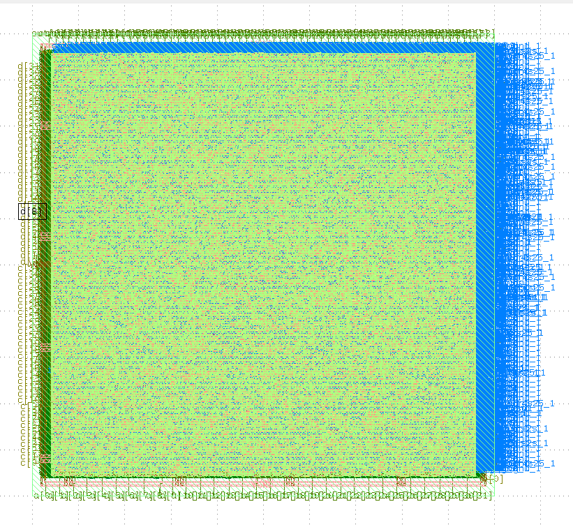
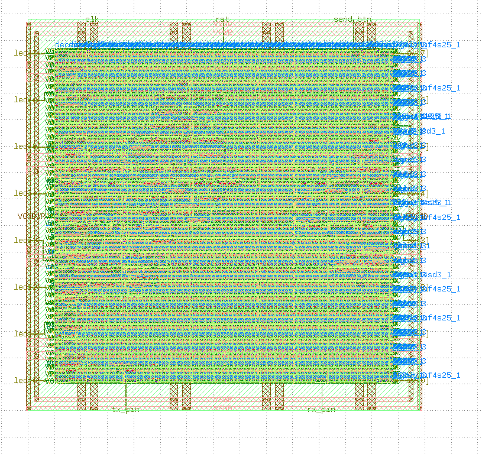
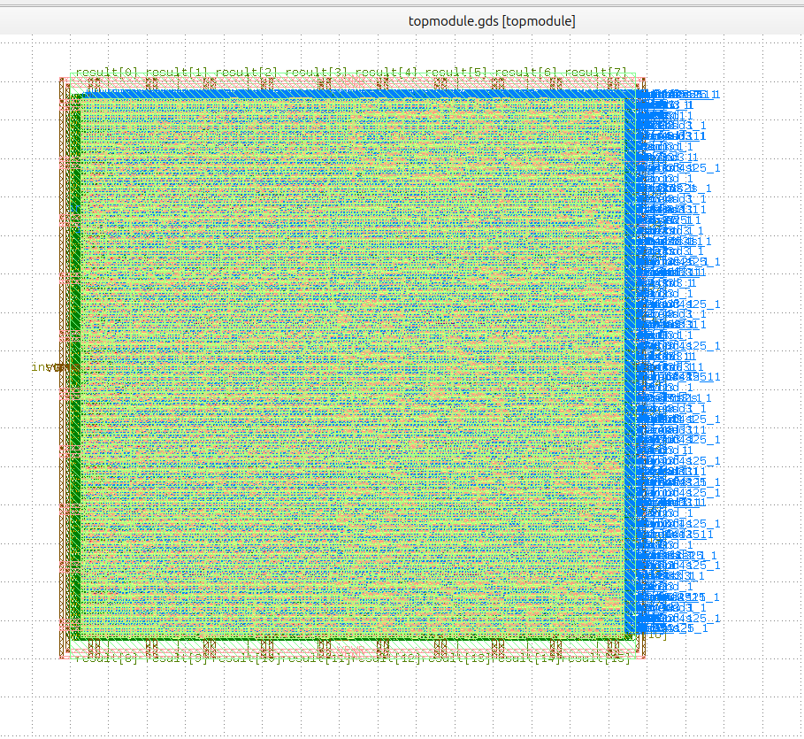

# Open-Source ASIC Physical Design Portfolio (SkyWater 130nm)

An open-source ASIC physical design portfolio demonstrating end-to-end RTL-to-GDSII tape-out flows using **LibreLane / OpenLane** on the **SkyWater 130nm (`sky130_fd_sc_hd`)** PDK. 

This repository spans arithmetic accelerators, communication peripherals, microprocessor physical closure, and hierarchical multi-macro integration—all validated through sign-off with **Zero DRC, Zero LVS, and Zero Antenna violations**.

---

## 🚀 Projects Overview

| Project | Description | Standard Cells / Instances | Area ($\mu\text{m}^2$) | Key Sign-off Highlights | Documentation |
| :--- | :--- | :---: | :---: | :--- | :---: |
| **Serial-Parallel Multiplier** | Dual 32-bit arithmetic accumulator ($a \cdot b + c \cdot d$) | 39,021 cells | $500 \times 500$ | 0 DRC / LVS, 107k vias, 451mm wirelength | [View Details](serial_parallel_multiplier/) |
| **UART Transceiver** | Configurable full-duplex serial interface | 543 cells (3,940 total) | $148 \times 148$ | Setup WS: +3.83ns, Hold WS: +0.25ns, 0.57mW | [View Details](uart_transceiver/) |
| **Single-Cycle RISC-V Core** | 32-bit microarchitecture execution core | 5,526 cells (12,723 total) | $282 \times 280$ | 66.6 MHz nominal closure, 70.8% core util | [View Details](riscv_core/) |
| **Manual Macro Placement** | Hierarchical floorplan integrating 2 hard macros | 702 cells + 2 Macros | $320 \times 320$ | Deterministic halo margins, zero macro DRCs | [View Details](manual_macro_placement/) |

---

## 📐 Layout & Die Gallery

| Serial-Parallel Multiplier (SPM) | UART Transceiver |
| :---: | :---: |
|  |  |
| **Single-Cycle RISC-V Core** | **Hierarchical Macro Placement** |
|  |  |

---

## 🛠️ Toolchain & Methodology

* **PDK:** SkyWater 130nm (`sky130A`) High-Density Library (`sky130_fd_sc_hd`)
* **Synthesis:** Yosys (Logic Synthesis & Technology Mapping)
* **Floorplanning & P&R:** OpenROAD (`RePlace` Global Placement, `TritonCTS`, `TritonRoute`)
* **Physical Verification:** Magic (DRC & Extraction), Netgen (LVS)
* **Static Timing Analysis (STA):** OpenSTA across Multi-Corner Multi-Mode (MCMM) PVT operating conditions
* **Automation Flow:** LibreLane / OpenLane containerized workflow

---

## 📂 Repository Structure

```text
ASIC-Physical-Design-Sky130/
├── serial_parallel_multiplier/   # 32-bit dual arithmetic multiplier
│   ├── src/                      # RTL sources & SDC constraints
│   ├── images/                   # Layout and routed screenshots
│   └── README.md                 # Detailed sign-off report
├── uart_transceiver/             # Configurable asynchronous transceiver
│   ├── src/                      # Verilog RTL & pin mapping
│   ├── images/                   # Layout visualizations
│   └── README.md                 # Multi-corner timing & QoR report
├── riscv_core/                   # 32-bit single-cycle processor
│   ├── src/                      # Processor RTL implementation
│   ├── images/                   # PDN grid & final GDS views
│   └── README.md                 # MCMM timing closure & architecture report
├── manual_macro_placement/       # Multi-macro hierarchical integration
│   ├── macro_placement.cfg       # Deterministic floorplan coordinates
│   ├── images/                   # Top-level macro placement layouts
│   └── README.md                 # Hierarchical flow methodology
└── README.md                     # Main portfolio dashboard
