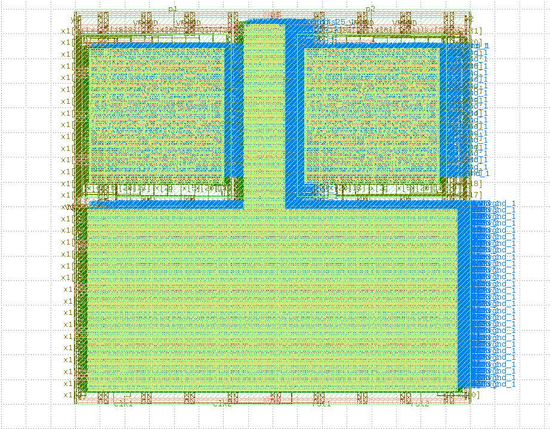
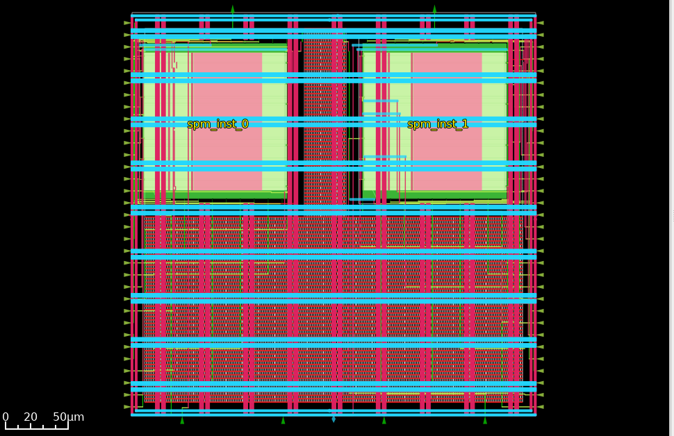

# Hierarchical ASIC Implementation with Manual Macro Placement

Hierarchical floorplanning and physical design integrating two hardened **Serial-Parallel Multiplier (SPM)** macro blocks with glue logic on the **SkyWater 130nm (`sky130_fd_sc_hd`)** PDK using **LibreLane**.

---

## 1. Physical Layout & Macro Placement Views

| KLayout GDSII Sign-off View | OpenROAD Post-PNR Routed View |
| :---: | :---: |
|  |  |

---

## 2. Floorplanning & Macro Coordinates

Dual hardened SPM macros placed deterministically using `macro_placement.cfg` to prevent pin-abutment congestion and balance routing channels:

| Macro Instance | Macro Type | X Position ($\mu\text{m}$) | Y Position ($\mu\text{m}$) | Orientation |
| :--- | :--- | :---: | :---: | :---: |
| `spm_inst_0` | Hard Multiplier Core | 5.59 | 168.23 | North (N) |
| `spm_inst_1` | Hard Multiplier Core | 179.87 | 168.23 | North (N) |

---

## 3. Tape-out Sign-off Metrics

| Metric Category | Parameter | Sign-off Value | Status |
| :--- | :--- | :--- | :---: |
| **Physical Sign-off** | **Magic DRC Errors** | **0** | **PASSED** |
| | **Antenna Violations** | **0** | **PASSED** |
| | **LVS Verification** | **Clean** | **PASSED** |
| **Die & Silicon Utilization** | **Die Dimensions** | $320.00 \times 320.00\ \mu\text{m}$ ($102,400\ \mu\text{m}^2$) | Target Met |
| | **Total Instance Area** | $80,654.1\ \mu\text{m}^2$ | Sign-off |
| | **Hard Macro Area** | $31,714.7\ \mu\text{m}^2$ (2 instances) | Placed |
| | **Standard Cell Logic Area** | $895.86\ \mu\text{m}^2$ | Synthesized |
| | **Physical Fillers Area** | $48,043.6\ \mu\text{m}^2$ | DRC Met |
| **Logic & Structural Breakdown** | **Hard Macros** | 2 (`spm_inst_0`, `spm_inst_1`) | Clean |
| | **Active Standard Cells** | 702 gates | Mapped |
| | **Fill Cells** | 13,254 instances | Filled |
| | **Tap Cells** | 700 instances | Latch-up Clean |
| **Interconnect & Routing** | **Total Routed Wirelength** | 14,345 $\mu\text{m}$ (14.35 mm) | 100% Routed |
| | **Total Vias Cut** | 232 vias (Single-cut: 232) | Clean |
| | **Max Net Wirelength** | 451.90 $\mu\text{m}$ | Passed |
| **Power Consumption** | **Total Power Dissipation** | **2.236 $\mu\text{W}$** | Analyzed |

---

## 4. Hierarchical Design Methodology

1. **Macro Hardening & Black-boxing:** Sub-blocks hardened independently to generate abstracted LEF files and timing models (LIBs).
2. **Deterministic Floorplanning:** Pre-placed macros with custom orientation (`N`) and boundary halo margins to avoid routing blockages.
3. **Power Routing Around Macros:** Dedicated PDN routing and power straps avoiding macro internal routing layers.
4. **Top-Level Integration:** TritonRoute connected top-level I/O pins, control logic, and macro ports with zero design rule violations.
