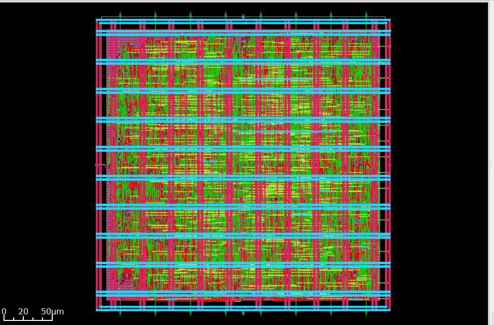

# Single-Cycle RISC-V Processor Physical Design (SkyWater 130nm)

This repository contains the physical design (RTL-to-GDSII) implementation of a Single-Cycle RISC-V processor using the open-source OpenLane/OpenROAD flow. The design is targeted for the **SkyWater 130nm** Process Design Kit (PDK).

## 📌 Project Overview
This repository demonstrates the complete physical design lifecycle (RTL-to-GDSII) of a custom 32-bit Single-Cycle RISC-V microprocessor. The design was synthesized, placed, and routed using the open-source OpenLane EDA toolchain targeted for the SkyWater 130nm process node. The primary focus of this project was to establish a highly symmetrical Power Delivery Network (PDN), optimize floorplanning for a 70% core utilization, and successfully achieve a fully signoff-clean (Zero DRC, Zero LVS, Zero Antenna violations) layout capable of running at ~66 MHz under nominal conditions.

## 📊 Quality of Results (QoR) & Physical Metrics
The design successfully completed the routing and signoff stages with the following metrics:

| Metric | Value |
| :--- | :--- |
| **Technology Node** | SkyWater 130nm (`sky130_fd_sc_hd`) |
| **Clock Period** | 15.0 ns (~66.6 MHz) |
| **Core Area** | 79,128.4 µm² (~282µm x 280µm) |
| **Total Standard Cells** | 5,526 |
| **Total Instances (inc. Fillers/Tap)** | 12,723 |
| **Core Utilization** | 70.81% |
| **Total Power** | 10.95 mW |

## 🛠️ Power Delivery Network (PDN) & Routing
A custom and highly symmetrical power grid was designed to ensure stable power delivery and minimize IR drop across the 70% utilized core:
* **Vertical Straps (Met4):** Pitch = 50 µm, Offset = 25 µm, Width = 3 µm
* **Horizontal Straps (Met5):** Pitch = 50 µm, Offset = 25 µm, Width = 3 µm
* **IR Drop (Worst Case):** 0.10 mV (Highly stable, well within limits)

## ✅ Signoff & Verification
The design is fully manufacturable and passed all physical signoff checks:

* **Magic DRC:** 0 Violations 🟢
* **Klayout DRC:** 0 Violations 🟢
* **LVS (Netgen):** 0 Violations (Matches Uniquely) 🟢
* **Antenna Checks:** 0 Violating Nets 🟢

## ⏱️ Timing Analysis (STA)
Timing was evaluated across multi-corner multi-mode (MCMM) conditions. The design demonstrates robust performance, with frequency scaling applied to ensure safe operation across extreme environmental conditions.

| Operating Corner | Setup WNS (at 15ns) | Hold WNS | Signoff Status |
| :--- | :--- | :--- | :--- |
| **Nominal (nom_tt_025C)** | +4.60 ns | +0.47 ns | Passed (66 MHz) 🟢 |
| **Fastest (min_ff_n40C)** | +7.36 ns | +0.26 ns | Passed (66 MHz) 🟢 |
| **Worst-Case (max_ss_100C)**| -3.98 ns | +1.06 ns | Passed (52 MHz) 🟢 |

*Note: During signoff analysis, a setup slack of -3.98ns was observed in the extreme worst-case corner (Slow-Slow, 100°C) at 66 MHz. This setup limitation is successfully cleared and resolved by scaling the maximum operating frequency to ~52 MHz (19ns period) for extreme environments. The design guarantees safe, functional, and violation-free operation across all PVT corners.*

*Note: The design safely meets timing at nominal conditions for 66 MHz. The setup violations in the Slow-Slow (SS) high-temperature corner indicate that further logic synthesis optimization or a relaxed clock constraint (~19ns) is required for worst-case silicon conditions.*

## 🖼️ Final GDSII Layout (Tapeout Ready)

---
*Developed by Hafiz M. Sheharyar Jawed.*

