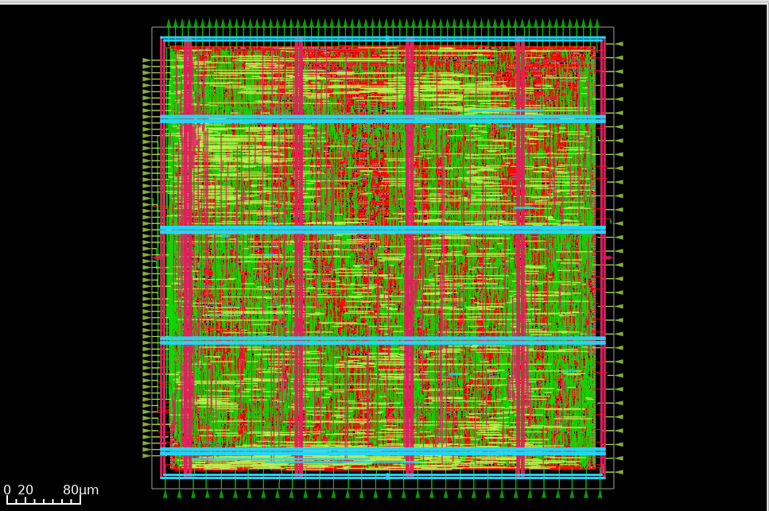

# Serial-Parallel Multiplier (SPM) - 32-bit Dual Arithmetic Core

Full physical implementation of a 32-bit dual arithmetic multiplier and accumulator ($a \cdot b + c \cdot d$) hardened on the **SkyWater 130nm (`sky130_fd_sc_hd`)** PDK using the **LibreLane** automated ASIC flow.

---

## 1. Physical Layout & Routing Views

| KLayout GDSII Sign-off View | OpenROAD Post-PNR Routed View |
| :---: | :---: |
|  |  |

---

## 2. Tape-out & Sign-off Metrics

| Metric Category | Parameter | Measured Sign-off Value | Status |
| :--- | :--- | :--- | :---: |
| **Manufacturing Verification** | **Magic DRC Violations** | **0** | **PASSED** |
| | **Netgen LVS Violations** | **0** | **PASSED** |
| | **Antenna Violations** | **0** | **PASSED** |
| **Physical Dimensions** | **Die Area** | $500.00 \times 500.00\ \mu\text{m}$ ($0.25\ \text{mm}^2$) | - |
| | **Core Area** | $480.00 \times 480.00\ \mu\text{m}$ ($0.23\ \text{mm}^2$) | - |
| | **Standard Cell Area** | $209,991\ \mu\text{m}^2$ | - |
| | **Core Utilization** | ~91.14% | Target Met |
| **Logic & Complexity** | **Total Cell Count** | 39,021 gates | Synthesized |
| | **Inferred Latches** | 0 | Clean |
| | **XNOR2 / XOR2 Instances** | 1,258 cells | Mapped |
| | **Complex AOI/OAI Gates** | 1,530+ cells (`o211a`, `o21a`, etc.) | Optimized |
| **Interconnect & Routing** | **Total Routed Wirelength** | 451,863 $\mu\text{m}$ (451.86 mm) | Routed |
| | **Total Vias Cut** | 107,853 (Single-cut: 107,853) | 100% Routed |
| | **Maximum Wirelength** | 672.5 $\mu\text{m}$ | DRC Met |
| **Power Consumption** | **Total Power** | **0.848 W** | Sign-off |
| | **Switching Power** | 0.483 W (56.9%) | - |
| | **Internal Power** | 0.365 W (43.1%) | - |
| | **Leakage Power** | 214.99 nW | - |
| **Timing Closure** | **Worst Hold Slack (WS)** | **+1.124 ns** | **PASSED** |
| | **Hold TNS / WNS** | 0.0 ns (0 violations) | **PASSED** |
| | **Max Slew Violations** | 0 | **PASSED** |
| | **Max Cap Violations** | 0 | **PASSED** |

---

## 3. Physical Implementation Details

* **Synthesis:** Synthesized via **Yosys** into 39,021 standard cells from the `sky130_fd_sc_hd` library, mapping multi-input arithmetic logic with zero latches inferred.
* **Floorplanning & PDN:** Configured symmetrical $500 \times 500\ \mu\text{m}$ boundary with dual-layer power rings on `met4` (vertical) and `met5` (horizontal) with standard cell power rails (`met1`).
* **Placement:** Executed routability-driven and congestion-aware global and detailed placement via `RePlace` and OpenROAD.
* **Detailed Routing:** Routed using TritonRoute across five metal layers without DRC or antenna violations.
* **Tape-out Sign-off:** Sign-off GDSII and LEF macro streamed via Magic and Netgen.

---

## 4. Manufacturability Sign-off Verdict

```text
====================================================================
                     MANUFACTURABILITY REPORT                       
====================================================================
  * Antenna Checks  : PASSED [0 violations]
  * Netgen LVS      : PASSED [Netlists match uniquely]
  * Magic DRC       : PASSED [0 violations found]
  * Hold Timing     : PASSED [Hold Slack: +1.124 ns]
  * Slew & Cap      : PASSED [0 violations]
====================================================================
