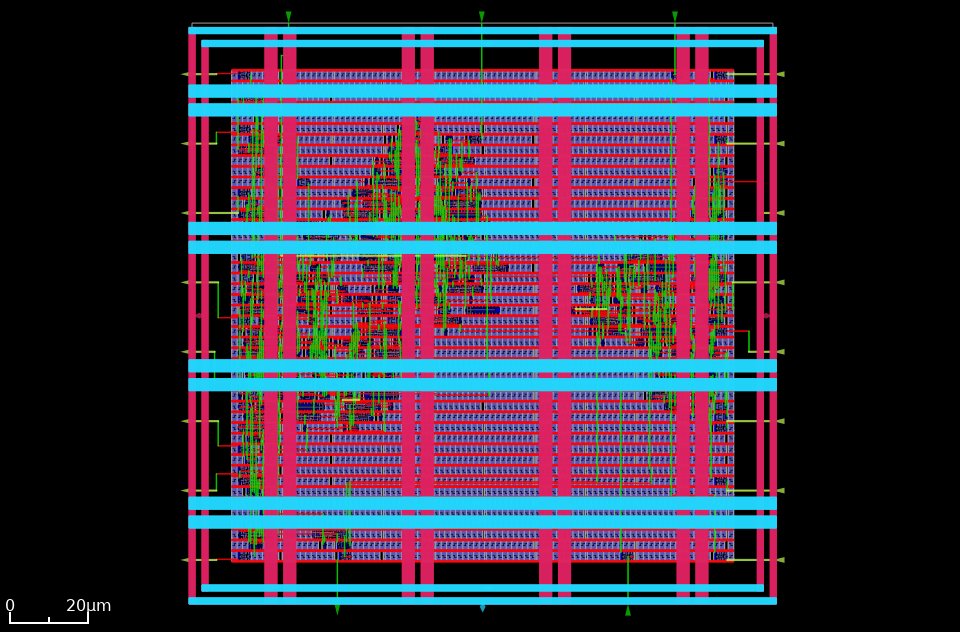

# UART Transceiver - SkyWater 130nm ASIC Implementation

Full RTL-to-GDSII physical implementation of an asynchronous serial communication transceiver (UART Transmitter & Receiver with configurable baud generator) hardened on the **SkyWater 130nm (`sky130_fd_sc_hd`)** PDK using the **LibreLane** flow.

---

## 1. Physical Layout & Routing Views

| KLayout GDSII Sign-off View | OpenROAD Post-PNR Routed View |
| :---: | :---: |
|  |  |

---

## 2. Tape-out Sign-off Metrics

All checks passed with positive timing margin across all PVT corners:

| Metric Category | Parameter | Sign-off Value | Status |
| :--- | :--- | :--- | :---: |
| **Manufacturing Verification** | **Magic DRC Violations** | **0** | **PASSED** |
| | **Netgen LVS Violations** | **0** | **PASSED** |
| | **Antenna Violations** | **0** | **PASSED** |
| **Die & Standard Cell Area** | **Total Die Area** | $21,904\ \mu\text{m}^2$ (~$148 \times 148\ \mu\text{m}$) | Target Met |
| | **Standard Cell Logic Area** | $4,107.69\ \mu\text{m}^2$ | Optimized |
| | **Total Instance Area (incl. Fillers)** | $16,000.3\ \mu\text{m}^2$ | Sign-off |
| **Logic & Structural Composition** | **Active Standard Cells** | 543 logic gates | Synthesized |
| | **Sequential Instances (DFFs)** | 49 flip-flops ($1,287.48\ \mu\text{m}^2$) | Mapped |
| | **Combinational Logic Instances** | 129 multi-input gates | Optimized |
| | **Inverters & Buffers** | 56 inverters, 77 repair buffers | Inserted |
| | **Clock Tree Buffers** | 16 clock buffers ($277.77\ \mu\text{m}^2$) | Balanced |
| | **Physical Fillers & Tap Cells** | 3,397 fill cells, 216 tap cells | DRC Clean |
| **Interconnect & Routing** | **Total Routed Wirelength** | 6,487 $\mu\text{m}$ (6.49 mm) | 100% Routed |
| | **Total Vias Cut** | 1,989 (Single-cut: 1,989) | Clean |
| | **Max Single Net Wirelength** | 213.94 $\mu\text{m}$ | DRC Met |
| **Power Profile** | **Total Power Dissipation** | **0.574 mW** ($573.83\ \mu\text{W}$) | Optimized |
| **Multi-Corner Timing Closure** | **Worst Setup Slack (WSS)** | **+3.834 ns** (`max_ss_100C_1v60`) | **PASSED** |
| | **Worst Hold Slack (WHS)** | **+0.256 ns** (`min_ff_n40C_1v95`) | **PASSED** |
| | **Setup Timing Violations** | **0** (All Corners) | **PASSED** |
| | **Hold Timing Violations** | **0** (All Corners) | **PASSED** |
| | **Max Slew / Cap Violations** | **0 / 0** | **PASSED** |

---

## 3. Physical Design Flow Highlights

* **Logic Synthesis:** Yosys mapped the Verilog RTL into 543 logic cells from the high-density standard cell library (`sky130_fd_sc_hd`), ensuring zero inferred latches and optimal clock-gating structures.
* **Floorplanning & PDN:** Symmetrical die configured with dedicated power stripes on `met4` and `met5`, standard-cell rail taps on `met1`, and uniform tap cell distribution preventing latch-up.
* **Clock Tree Synthesis (CTS):** TritonCTS synthesized a low-skew clock distribution network using 16 specialized clock buffers, keeping skew minimal across corner variations.
* **Routing & Optimization:** TritonRoute achieved 100% routing completion within 4 iterations, using 1,989 single-cut vias without congestion or antenna rule violations.
* **Sign-off:** Streamed out to GDSII and validated against foundry design rules via Magic DRC and Netgen LVS.

---

## 4. Manufacturability Sign-off Verdict

```text
====================================================================
                     MANUFACTURABILITY REPORT                       
====================================================================
  * Antenna Checks    : PASSED [0 violations]
  * Netgen LVS        : PASSED [Netlists match uniquely]
  * Magic DRC         : PASSED [0 violations found]
  * Multi-Corner STA  : PASSED [Setup WS: +3.834 ns | Hold WS: +0.256 ns]
  * Slew / Capacitance: PASSED [0 violations across all corners]
====================================================================
